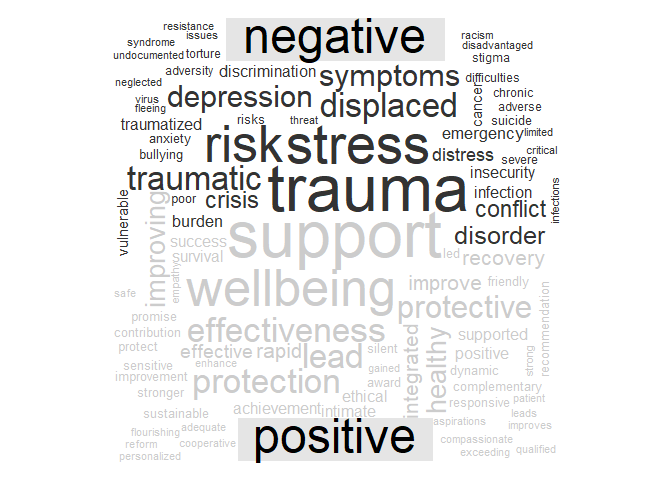

Visualizing Themes in Research About Refugee Children
================
Sebastian Santana Ortiz
2023-Mar-03

<style type="text/css">
#r-markdown  {
  margin-top: 6em;
}
&#10;#r-markdown p:first-of-type {
  margin-bottom: 3em;
}
</style>

> As part of a past RA position, I was asked to do a cursory literature
> review on the health and education outcomes of refugee children. In
> the past five years, more than 1,000 related articles were published
> in PubMed datasets. I was able to read and code 200 in a week, for the
> rest I used R.

> The code I used to analyze text is based on the [“Text Mining with
> R”](https://www.tidytextmining.com/index.html) textbook, published by
> Julia Silge and David Robinson.

# 1 Load and Clean Data

## 1.1 Load PubMed File

``` r
loaded_data = read.csv("5 years - PubMed.csv")

unique_data <- loaded_data[!duplicated(loaded_data$DOI), ]

token_data <- unique_data %>%
  mutate(Publication.Year = as.character(unique_data$Publication.Year))%>%
  filter(Item.Type != "bookSection") %>%
  filter(Publication.Year != "2018")%>%
  select(Publication.Year, Title,  DOI, )%>%
  unnest_tokens(word, Title) # Converts the contents of the "title" variable into one word tokens 
```

## 1.2 Filter stop words and fillers

``` r
data(stop_words) # Load common stop words

data <- token_data %>%
  anti_join(stop_words) # deletes filler words (e.g., "the", "and", "or")

data %>%
  count(word, sort = TRUE) %>%
  filter(n > 71) %>%
  mutate(word = reorder(word, n)) %>%
  ggplot(aes(n, word)) +
  geom_col() +
  labs(y = NULL)
```

<!-- -->

## 1.3 Filtering words related to keywords

``` r
data_filtered = data %>%
  filter(word != "children" & word != "refugee" & word != "study" & word != "refugees" & word != "youth")

data_filtered %>%
  count(word, sort = TRUE) %>%
  filter(n > 60) %>%
  mutate(word = reorder(word, n)) %>%
  ggplot(aes(n, word)) +
  geom_col() +
  labs(y = NULL)
```

<!-- -->

# 2 Sentiment Analysis

## 2.1 Get and join sentiment data with title words

``` r
bing_word_counts <- data_filtered %>%
  inner_join(get_sentiments("bing")) %>%
  count(word, sentiment, sort = TRUE) %>%
  ungroup()
```

## 2.2 Frequency of positive and negative words in histogram

``` r
bing_word_counts %>%
  group_by(sentiment) %>%
  slice_max(n, n = 10) %>% 
  ungroup() %>%
  mutate(word = reorder(word, n)) %>%
  ggplot(aes(n, word, fill = sentiment)) +
  geom_col(show.legend = FALSE) +
  facet_wrap(~sentiment, scales = "free_y") +
  labs(x = "Contribution to sentiment",
       y = NULL)
```

<!-- -->

## 2.3 Frequency of positive and negative words in word cloud

``` r
data_filtered %>%
  inner_join(get_sentiments("bing")) %>%
  count(word, sentiment, sort = TRUE) %>%
  acast(word ~ sentiment, value.var = "n", fill = 0) %>%
  comparison.cloud(colors = c("gray20", "gray80"),
                   max.words = 100)
```

<!-- -->

## 2.4 Ratio of positive to negative word usage across years

``` r
ratio_hist <- data_filtered %>%
  inner_join(get_sentiments("bing")) %>%
  count(Publication.Year, index = row_number() %/% 40, sentiment) %>%
  pivot_wider(names_from = sentiment, values_from = n, values_fill = 0) %>% 
  mutate(sentiment = positive - negative)


ggplot(ratio_hist, aes(index, sentiment, fill = Publication.Year)) +
  geom_col(show.legend = FALSE) +
  facet_wrap(~Publication.Year, ncol = 2, scales = "free_x")
```

<!-- -->

# 3 Correlations

## 3.1 Using Widyr to compute pairwise correlations

> From “Text Mining with R” chapter 4: “In particular, here we’ll focus
> on the phi coefficient, a common measure for binary correlation.”

``` r
row_by_Year <- data_filtered %>%
  group_by(Publication.Year) %>% 
  mutate(section = row_number() %/% mean_char_length) %>% 
  # Section number is based on the averahe length of a title in the dataset
  ungroup()

word_cors <- row_by_Year %>%
  group_by(word) %>%
  filter(n() >= 10) %>%
  widyr::pairwise_cor(word, section, sort = TRUE)
```

## 3.2 Most associated words with top positive and negative words

``` r
word_cors %>%
  filter(item1 %in% c("trauma", "stress", "support", "wellbeing")) %>%
  group_by(item1) %>%
  top_n(5, correlation)%>%
  #slice_max(correlation, n = 2) %>%
  ungroup() %>%
  mutate(item2 = reorder(item2, correlation)) %>%
  ggplot(aes(item2, correlation)) +
  geom_bar(stat = "identity") +
  facet_wrap(~ item1, scales = "free") +
  coord_flip()
```

<!-- -->

# 4 N-grams: Bigrams

## 4.1 Creating and filtering bigrams

``` r
bigrams_data <- unique_data %>%
  mutate(Publication.Year = as.character(unique_data$Publication.Year))%>%
  filter(Item.Type != "bookSection") %>%
  select(Publication.Year, Author, Title,  DOI, Abstract.Note, Relevant)%>%
  unnest_tokens(bigram, Title, token = "ngrams", n = 2) %>%
  filter(!is.na(bigram))

bigrams_separated <- bigrams_data %>%
  separate(bigram, c("word1", "word2"), sep = " ")

bigrams_filtered <- bigrams_separated %>%
  filter(!word1 %in% stop_words$word) %>%
  filter(!word2 %in% stop_words$word)

# new bigram counts:
bigram_counts <- bigrams_filtered %>% 
  count(word1, word2, sort = TRUE)

bigrams_united <- bigrams_filtered %>%
  unite(bigram, word1, word2, sep = " ")

bigram_tf_idf <- bigrams_united %>%
  count(Publication.Year, bigram) %>%
  bind_tf_idf(bigram, Publication.Year, n) %>%
  arrange(desc(tf_idf))
```

## 4.2 Relative and Total Bigram Frequency

> Relative Frequency (based on Inverse Document Frequency)

``` r
bigram_tf_idf %>%
  group_by(Publication.Year) %>%
  slice_head(n = 4) %>%
  ungroup() %>%
  ggplot(aes(tf_idf, fct_reorder(bigram, tf_idf), fill = Publication.Year)) +
  geom_col(show.legend = FALSE) +
  facet_wrap(~Publication.Year, ncol = 2, scales = "free") +
  labs(x = "Inverse Document Frequnecy", y = NULL)
```

<!-- -->

> Total frequency

``` r
bigram_tf_idf %>%
  arrange(desc(n)) %>%
  group_by(Publication.Year) %>%
  slice_head(n = 4) %>%
  ungroup() %>%
  ggplot(aes(n, fct_reorder(bigram, n), fill = Publication.Year)) +
  geom_col(show.legend = FALSE) +
  facet_wrap(~Publication.Year, ncol = 2, scales = "free") +
  labs(x = "Frequency Count", y = NULL)
```

<!-- -->

## 4.3 Network of Bigrams

``` r
bigram_graph <- bigram_counts %>%
  filter(n > 15) %>%
  graph_from_data_frame()
```

> From “Text Mining with R” chapter 4: “As one common visualization, we
> can arrange the words into a network, or”graph.” Here we’ll be
> referring to a “graph” not in the sense of a visualization, but as a
> combination of connected nodes. A graph can be constructed from a tidy
> object since it has three variables: (1) from: the node an edge is
> coming from, (2) to: the node an edge is going towards, (3) weight: A
> numeric value associated with each edge.”

> This is a visualization of a Markov chain, a common model in text
> processing. Each word choice is contingent on the previous word alone.
> A random generator using this model might spit out “mental”, then
> “health”, then “care”, by producing the most common word that follows
> it.

``` r
set.seed(2020)
a <- grid::arrow(type = "closed", length = unit(.15, "inches"))
# directionality with an arrow, constructed using grid::arrow(), 
# including an end_cap option that tells the arrow to end before touching the node

ggraph(bigram_graph, layout = "fr") +
  geom_edge_link(aes(edge_alpha = n), show.legend = FALSE, 
                 # We edge_alpha aesthetic to the link layer to make 
                 # links transparent based on how common or rare the bigram is
                 arrow = a, end_cap = circle(.07, 'inches')) +
  geom_node_point(color = "lightblue", size = 5) +
  #  make the nodes more attractive (larger, blue points)
  geom_node_text(aes(label = name), vjust = .8, hjust = .8) +
  theme_void()
```

<!-- -->

# 5 N-grams: Trigrams

## 5.1 Computing and filtering trigrams

``` r
trigrams = unique_data %>%
  mutate(Publication.Year = as.character(unique_data$Publication.Year))%>%
  filter(Item.Type != "bookSection") %>%
  filter(Publication.Year != "2018") %>%
  select(Publication.Year, Author, Title,  DOI, Abstract.Note, Relevant)%>%
  unnest_tokens(trigram, Title, token = "ngrams", n = 3) %>%
  filter(!is.na(trigram)) 

trigrams_separated <- trigrams %>%
  separate(trigram, c("word1", "word2", "word3"), sep = " ")

data(stop_words)

trigrams_filtered <- trigrams_separated %>%
  filter(!word1 %in% stop_words$word,
         !word2 %in% stop_words$word,
         !word3 %in% stop_words$word) 
```

## 5.2 Common health related words

``` r
trigrams_filtered %>%
  filter(word1 == "health") %>%
  count(word2, sort = TRUE)%>%
  # Do the count but by year count(Publication.Year, word2, sort = TRUE) %>%
  arrange(desc(n)) %>%
  slice_head(n = 5) 
```

    ##         word2  n
    ## 1        care 11
    ## 2     related  5
    ## 3 information  3
    ## 4   screening  3
    ## 5    literacy  2

``` r
trigrams_filtered %>%
  filter(word1 == "health") %>%
  count(word3, sort = TRUE) %>%
  arrange(desc(n)) %>%
  slice_head(n = 5) 
```

    ##       word3 n
    ## 1   quality 5
    ## 2    access 2
    ## 3 providers 2
    ## 4  services 2
    ## 5    survey 2

## 5.3 Total Frequency

``` r
trigram_tf_idf %>%
  arrange(desc(n)) %>%
  group_by(Publication.Year) %>%
  slice_head(n = 4) %>%
  ungroup() %>%
  ggplot(aes(n, fct_reorder(trigrams, n), fill = Publication.Year)) +
  geom_col(show.legend = FALSE) +
  facet_wrap(~Publication.Year, ncol = 2, scales = "free") +
  labs(x = "n", y = NULL)
```

<!-- -->

## 5.4 Relative Frequency (based on Inverse Document Frequnecy)

``` r
trigram_tf_idf %>%
  group_by(Publication.Year) %>%
  slice_head(n = 4) %>%
  ungroup() %>%
  ggplot(aes(tf_idf, fct_reorder(trigrams, tf_idf), fill = Publication.Year)) +
  geom_col(show.legend = FALSE) +
  facet_wrap(~Publication.Year, ncol = 2, scales = "free") +
  labs(x = "tf-idf", y = NULL)
```

<!-- -->

# 6 Thematic Analysis

## 6.1 Creating themes using Latent Dirichlet allocation

> From chapter 6 of “Text Mining with R”: LDA is a mathematical method
> for estimating both of these at the same time: finding the mixture of
> words that is associated with each topic, while also determining the
> mixture of topics that describes each document.

``` r
test = title_counts %>%
  cast_dtm(DOI, word, n)

ap_lda <- LDA(test , k = 8, control = list(seed = 1234))

ap_topics <- tidy(ap_lda, matrix = "beta")

ap_top_terms <- ap_topics %>%
  group_by(topic) %>%
  slice_max(beta, n = 5) %>% # Minimum frequency
  ungroup() %>%
  arrange(topic, -beta)
```

## 6.2 Visualizing LDA classifications

``` r
ap_top_terms %>%
  mutate(term = reorder_within(term, beta, topic)) %>%
  ggplot(aes(beta, term, fill = factor(topic))) +
  geom_col(show.legend = FALSE) +
  facet_wrap(~ topic, scales = "free") +
  scale_y_reordered()
```

<!-- -->

$~$
